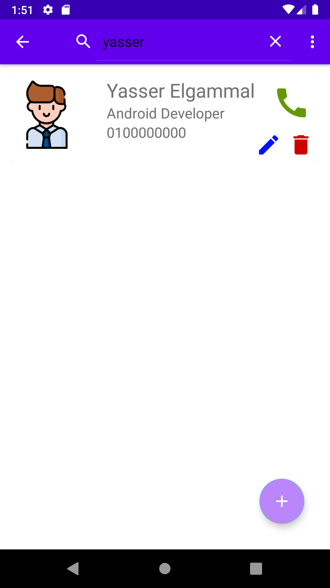

**What is the project?**
This app is used to save contacts data such as (name, phone, etc) with the ability to call directly from the app

**Main Features:**
1. Kotlin
2. MVVM
3. Room [CURD]
4. Coroutines
5. ViewBinding
6. SingleActivity
7. NavigationComponent

**ScreenShot**

